# webDAV建立

### 網路磁碟機
1. ```yum install epel-release```
2. 檢查httpd有沒有支援DAV
```
httpd -M | grep DAV
```
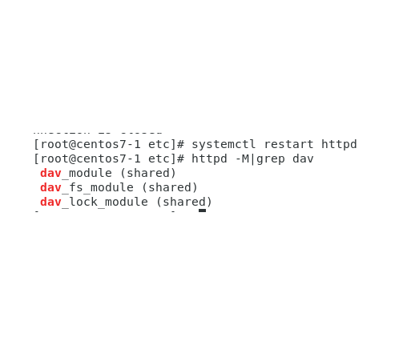<br>
3. 創建資料夾
```
mkdir /var/www/html/web
```
4.把擁有者和使用者權限切成apache
```chown -R apache:apache /var/www/html```
```chmod -R 755 /var/www/html```
5. ```vim /etc/httpd/conf.d/webdav.conf```
```
DavLockDB /var/www/html/DavLock
<VirtualHost *:80>
    ServerAdmin webmaster@localhost
    DocumentRoot /var/www/html/webdav/
    ErrorLog /var/log/httpd/error.log
    CustomLog /var/log/httpd/access.log combined
    Alias /webdav /var/www/html/webdav
    <Directory /var/www/html/webdav>
        DAV On
        #AuthType Basic
        #AuthName "webdav"
        #AuthUserFile /etc/httpd/.htpasswd
        #Require valid-user
        </Directory>
</VirtualHost>
```
6.```systemctl restart httpd```
### Successsfully
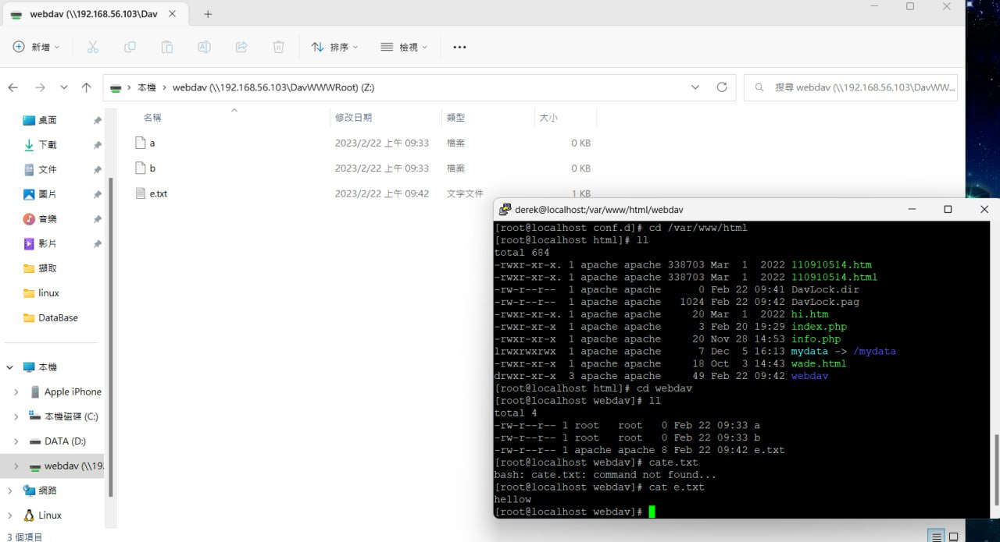<br>
# linux sed

linux 三劍客 awk/grep/[sed](https://shengyu7697.github.io/linux-sed/)

``` 
sed 's///g' setting.conf # s代表(substitute) 如果g在最後面代表取代全部沒g代表取代第一個
sed 's/Alan/tom' setting.conf #收尋Alan用tom取代,在這裡有沒有g沒差
								#first/後面打要收尋的東西second/打要取代
sed 's/Alan/tom' setting.conf #只改螢幕上的內容
sed -i 's/Alan/tom' setting.conf #連檔案內的一起更改
```

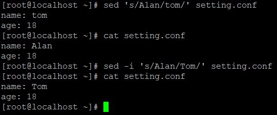

```
sed 's/name:.*/name:Dunk/g' setting.conf
```

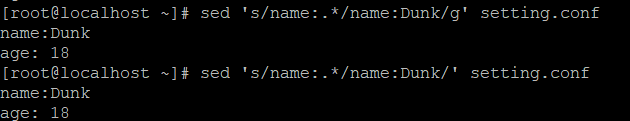

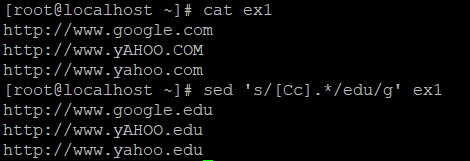

```
 sed 's/abc\ d/a\ bcd/' bb #因為空白為特殊符號所以前面需要加\
 sed 's#abc\ d#a\ bcd#' bb #意思同上
```

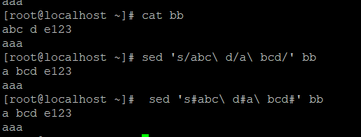

``` 
echo "1234" | sed 's/.*/(&)/' => (1234)
echo "qwertyuiop" | sed 's/.*/#&/' => #qwertyuiop #可以註解檔案
```


***


```
cat <<EOF >setting.conf #可以把輸入的文字存進setting.conf輸入EOF結束
```

### 例1:

腳本

```
echo "generate a.conf"
cat <<EOF >a.conf
name: Alan
age: 18
EOF


```

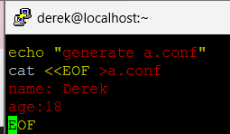

執行結果

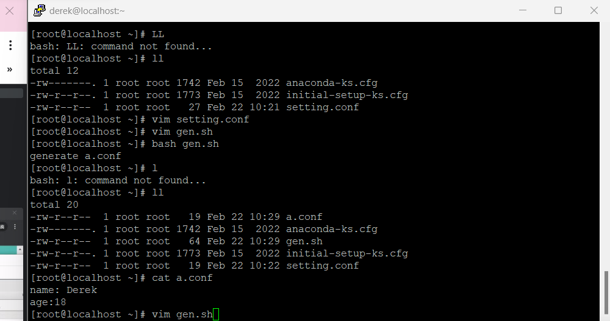

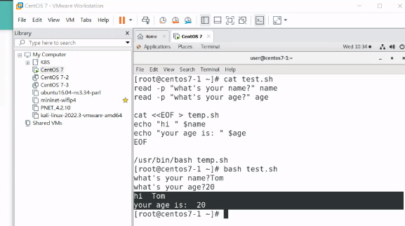

### 例2

腳本:

```
read -p "What's your name?" name #讀""裡的內容並存到後面
read -p "What's your age?" age

cat <<EOF > temp.sh 			#如果沒有temp.sh會自己建立
echo "hi " $name
echo "your age is: " $age
EOF

/usr/bin/bash temp.sh

```


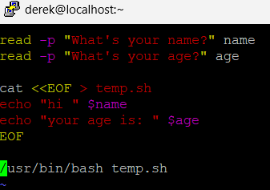

執行結果

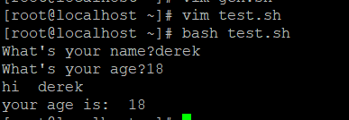

read

```
read -p "Do you want to continue? (Y/y for Yes, any other key for No) " answer
    case $answer in
        [Yy]* ) echo "Program continues..."; break;; #[Yy]* 正則表達式 重複前面的字元0次、1次...到多次
        * ) echo "Program exits."; exit;; # "*"代表default
    esac
```


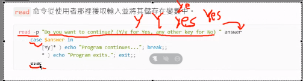

# 正則表達

```
^$ #代表空白行
echo "123456" | grep ".*" #收尋全部
echo "123456" | grep "3.*" #3開始到結束
```

刪除空白行

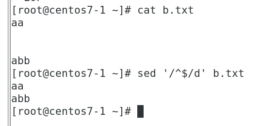
