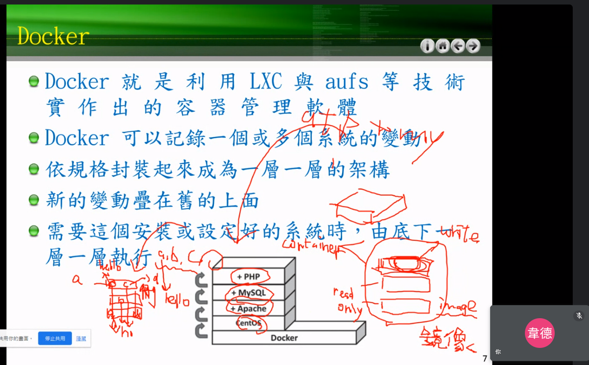
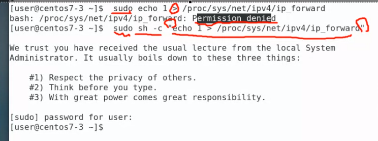
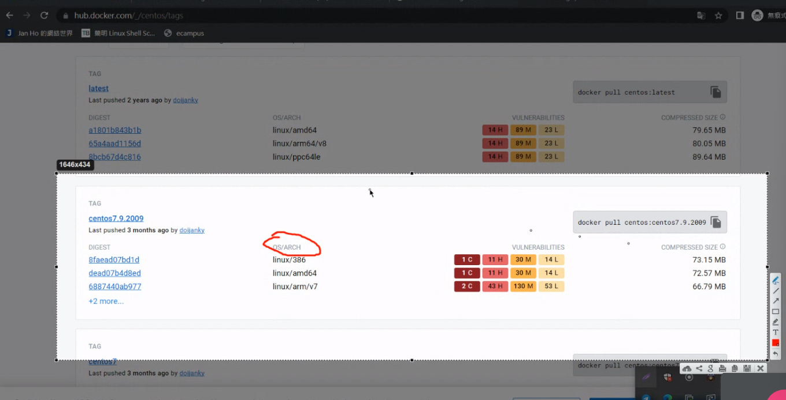
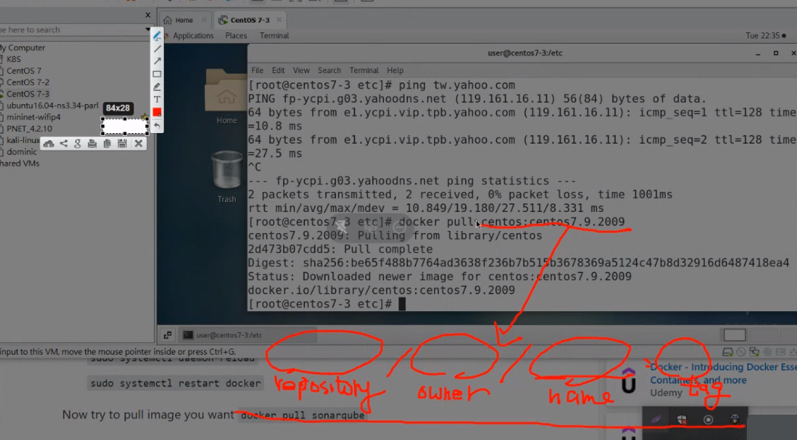
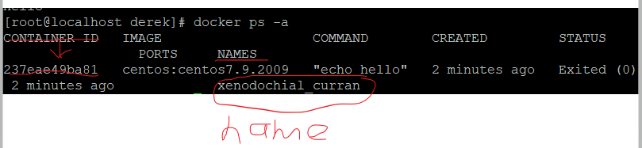
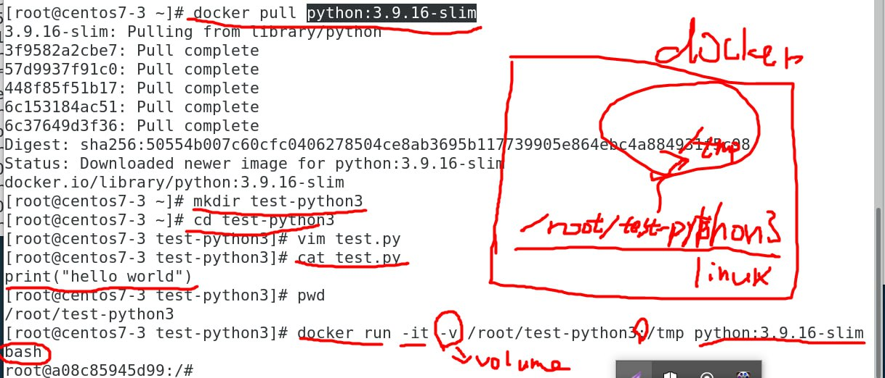
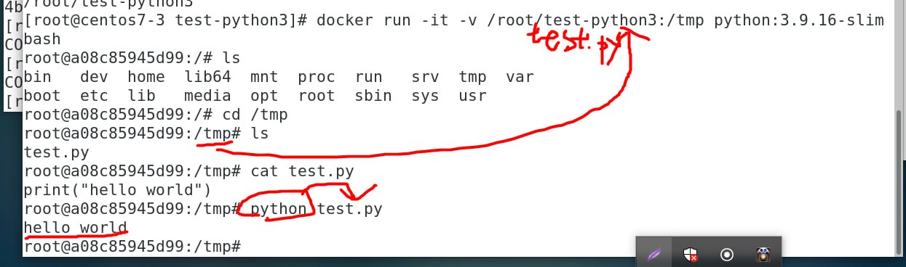

```
docker --version #檢查有沒有docker
```



```
echo 1 > /proc/sys/net/ipv4/ip_forward #可以把路由器打開 0關起來
sudo echo 1 > /proc/sys/net/ipv4/ip_forward #有大小於容易出現permission denied 要改成底下
sudo sh -c "echo 1 > /proc/sys/net/ipv4/ip_forward"
```



```
docker info #列出docker服務資訊
docker images #查看系統中有沒有任何鏡像
docker run centos:sentos7.9.2009 echo "hello"
docker run centos echo "hello" == docker run centos:latest echo "hello"
docker ps -a #可以看到死去的鏡像
docker ps #可以看到執行中的 

docker rmi (Image ID or Tag) #imageID可以打3個字
docker pull busybox #載busybo
docker run -it busybox sh #讓他一直跑sh
docker run -it --name b1 docker sh #自訂名字
docker commit b1 busybox:0.1
docker run -it --name b2 busybox:0.1 sh
docker ps -a -q #只出現contatner ID
docker rm `docker ps -a -q` #` `裡面的東西ㄗ會被替代
docker rm -f `docker ps -a -q` #-f 可以刪除還活著的檔案
```

### 去dockerhub下載鏡像



docker images 名稱格式



### 砍容器
`docker rm (名稱or Contatner ID) `

​	`contatnerID`可以只打前四個



### 砍映像檔
`docker rmi (Image ID or Tag)`

​	`imageID`可以打3個字

***

```
docker run -it -v /home/dere/test-python3:/tmp python:3.9.16-slim bash

```






***


