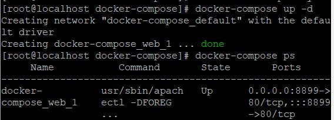
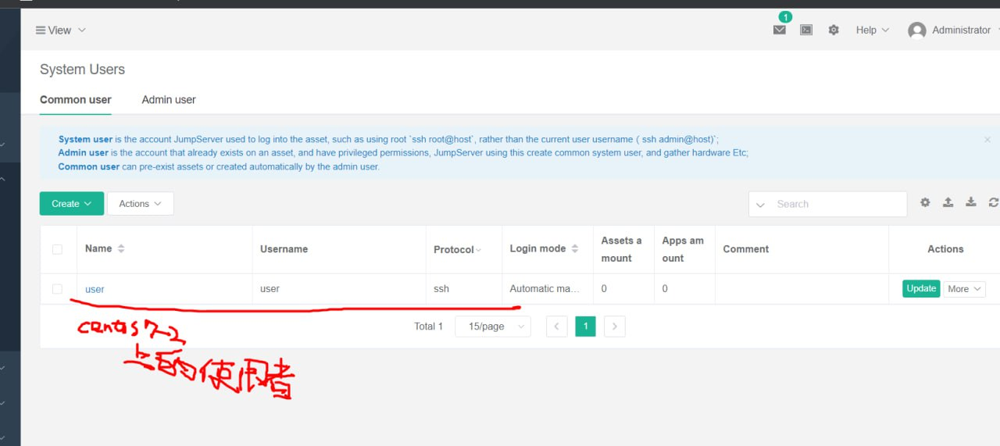
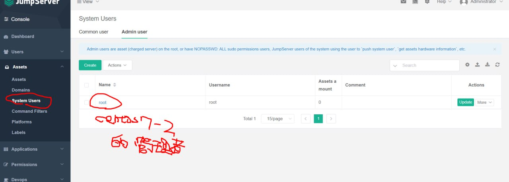
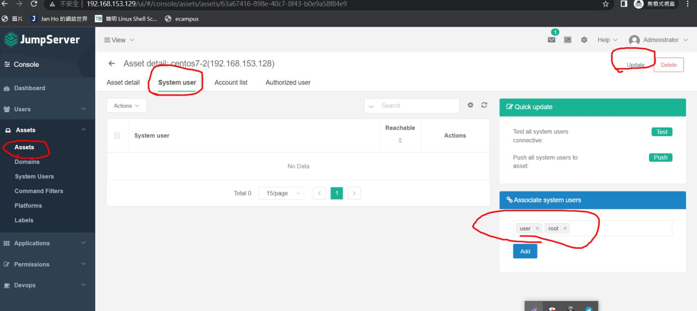
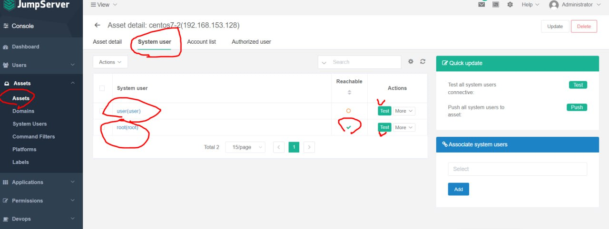

# dockerfile
* move to /var/www/html
<br>`cd /var/www/html`<br>
* create a hi.html
<br>`echo "hello" > hi.html`<br>
* create Dockerfile
<br>`vim Dockerfile`<br>
```
FROM centos:centos7.9.2009
RUN yum -y install httpd  # 自動確認
EXPOSE 80  # 80 port
ADD hi.html /var/www/html  # 將hi.html丟到docker的/var/www/html裡
```
# dockercompose
* [docker-compose introduction](https://www.runoob.com/docker/docker-compose.html)
* [CentOS 7 安裝 docker-compose](https://vocus.cc/article/5fbc6e73fd897800016cc9f6)
```
curl -L "https://github.com/docker/compose/releases/download/1.27.4/docker-compose-$(uname -s)-$(uname -m)" -o /usr/local/bin/docker-compose
chmod +x /usr/local/bin/docker-compose
docker-compose --version
```
<br>
`vim docker-compose.yml`<br>
***注意縮排***
```
version: '3'
services:
  web: 
    image: "centos:httpd"
    ports: 
      - "8800:80"
    command: "/usr/sbin/apachectl -DFOREGROUND"
```
`docker-compose up`:執行 docker-compose<br>
<br>
`docker-compose ps`:查看運行中的 docker-compose<br>
`docker-compose down`:停止 docker-compose<br>
# jumpserver
Install jumpserver: https://github.com/wojiushixiaobai/Dockerfile
```
git clone --depth=1 https://github.com/wojiushixiaobai/Dockerfile.git
cd Dockerfile
cp config_example.conf .env
docker-compose -f docker-compose-network.yml -f docker-compose-redis.yml -f docker-compose-mariadb.yml -f docker-compose-init-db.yml up -d
docker exec -i jms_core bash -c './jms upgrade_db'
docker-compose -f docker-compose-network.yml -f docker-compose-redis.yml -f docker-compose-mariadb.yml -f docker-compose.yml up -d 
```
***成功會顯示***
```
Recreating jms_core ... done
Creating jms_magnus ... done
Creating jms_lion   ... done
Creating jms_celery ... done
Creating jms_web    ... done
Creating jms_koko   ... done
```
* 到網頁輸入虛擬機IP
<br>
預設帳密皆為`admin`
## 新增user
<br>
## 創造asset
<br>
<br>
<br>
<br>
<br>
