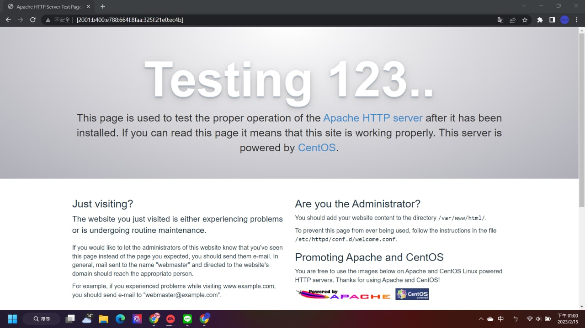
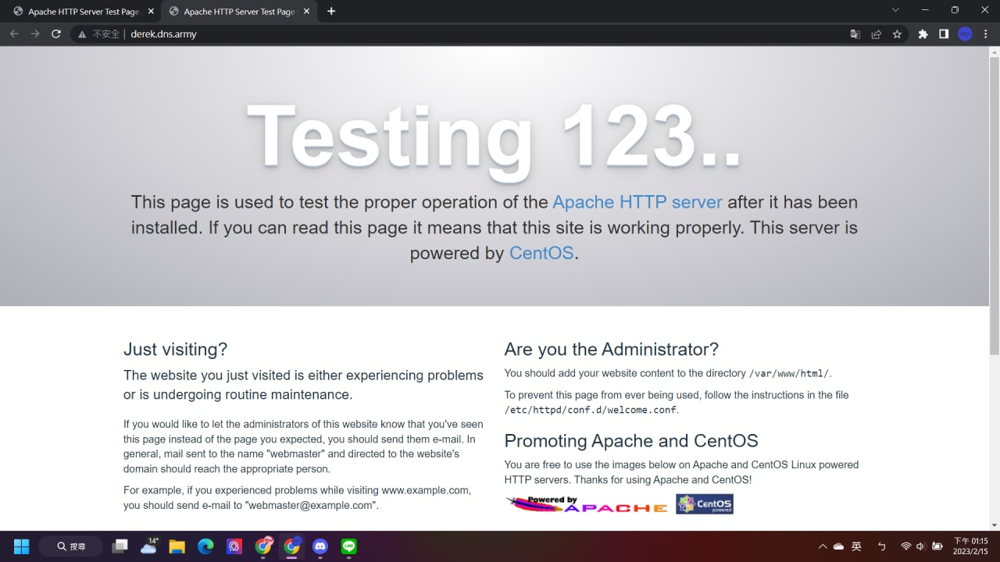

# ipv6_network
虛擬機網路卡設定<br>
<br>
測試網路有沒有支援ipv6  
* [ipv6 test link](https://test-ipv6.com/index.html.zh_TW)<br>
***
ipv6網址輸入
```
http://[ipv6 address]
```
successfully<br>

***
# ipv6短網址
[dyn6](https://dynv6.com)註冊後可使用
successfully<br>

