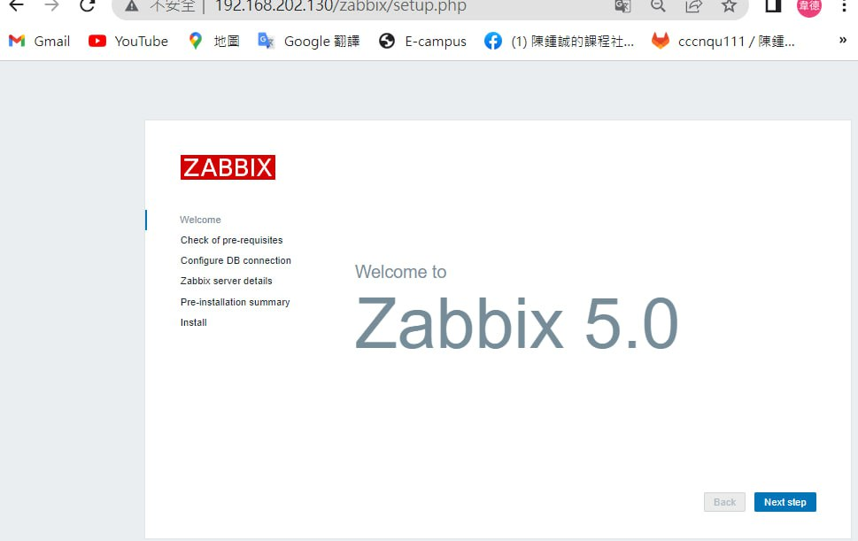
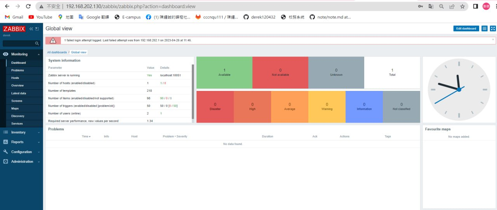

# email
1. 申請token:[google application](https://security.google.com/settings/security/apppasswords?pli=1)
2. `vim /etc/mail.rc`
<br>在最下面加上<br>
```
set smtp-use-starttls
set ssl-verify=ignore
set nss-config-dir=/etc/pki/nssdb/
set from=[your email]
set smtp=smtp://smtp.gmail.com:587
set smtp-auth-user=[your email]
set smtp-auth-password=[google application passwd]
set smtp-auth=login
```
***測試***
```
echo "hello world" | mail -v -s "Test1234" s110910514@student.nqu.edu.tw
```
# zabbix sever
需要三台虛擬機<br>
[Centos7系统安裝Zabbix 5.0](https://cloud.tencent.com/developer/article/1943154)<br>
```yum install mariadb-server mariadb -y```<br>
* setup db
> Disallow root和Remove test選n<br>
```$ mysql_secure_installation ```<br>
```
mysql -u root -p
create database zabbix_db character set utf8 collate utf8_bin;
create user zabbix@localhost identified by 'centos';  # 設定密碼為centos
grant all privileges on zabbix_db.* to zabbix@localhost;  # 讓zabbix使用zabbix_db全部權限
quit;
```

## Install zabbix
[zabbix官網](https://www.zabbix.com/)download 5.0LTScentos7
```
rpm -Uvh https://repo.zabbix.com/zabbix/5.0/rhel/7/x86_64/zabbix-release-5.0-1.el7.noarch.rpm
yum install zabbix-server-mysql zabbix-agent -y
yum install centos-release-scl -y
vim /etc/yum.repos.d/zabbix.repo
```
***enabled改成1***
```
[zabbix-frontend]
...
enabled=1
...
```
`yum install zabbix-web-mysql-scl zabbix-apache-conf-scl -y`<br>
導入 Zabbix 數據，並輸入mysql db的密碼<br>
<br>`zcat /usr/share/doc/zabbix-server-mysql*/create.sql.gz | mysql -uzabbix -p zabbix_db`<br>
修改帳號密碼<br>
<br>`vim /etc/zabbix/zabbix_server.conf`<br>
新增DBPassword和修改DBName<br>
```
DBName=zabbix_db    
DBUser=zabbix       
DBPassword=password 
```
修改時區<br>
<br>`vim /etc/opt/rh/rh-php72/php-fpm.d/zabbix.conf`<br>
***分號記得拿掉***
<br>`php_value[date.timezone] = Asia/Taipei`<br>
`systemctl restart zabbix-server zabbix-agent httpd rh-php72-php-fpm`<br>
在瀏覽器上輸入第一台虛擬機的IP<br>

1. 注意每一項都要是 OK 即可下一步
2. set
```
Database type : MySQL
Database host : localhost
Database port : 0
Database name : zabbix_db
User : zabbix
Password : password
```
***login***
*　默認帳號: Admin, 密碼: zabbix

# zabbixclient
* 在另外兩台上安裝
```
yum install https://repo.zabbix.com/zabbix/5.0/rhel/7/x86_64/zabbix-release-$ 5.0-1.el7.noarch.rpm -y
sudo yum install vim zabbix-agent zabbix-sender -y
sudo vim /etc/zabbix/zabbix_agentd.conf
```
* 需修改
```
Server=[伺服器IP]
ServerActive=[伺服器IP]
Hostname=[自己主機叫做什麼就改成什麼]
```
`systemctl start zabbix-agent`
