# Zabbix
```
systemctl start mariadb
systemctl start zabbix-agent
```
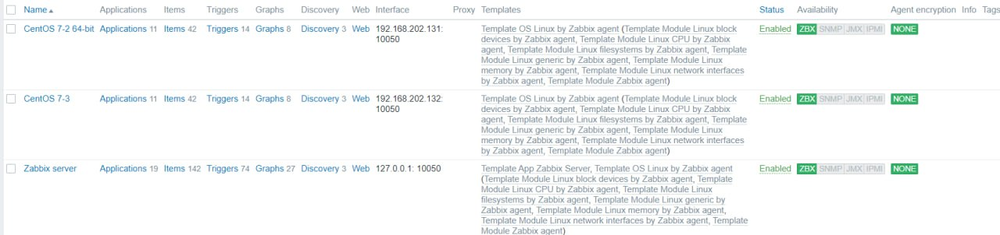<br>
> Applications

* 為大分類
* 有分成CPU、磁碟、檔案系統、網路卡、儲存等等，共17個項目

> Item

* Applications底下的細項
* 舉例 : CPU interrupt time、CPU guest time等等
* 若是別人有做好的就能用，若是沒有可以自己再加

> Triggers

* 設定如果有發生嚴重的事來觸發並通知
* 舉例 : CPU 過載、磁碟空間不足
* 發送 Email 或 Line 來通知
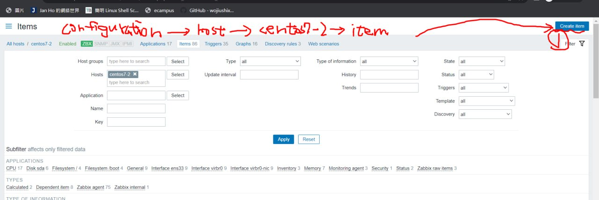
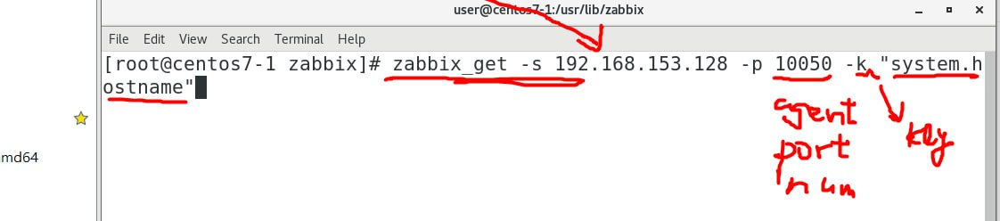
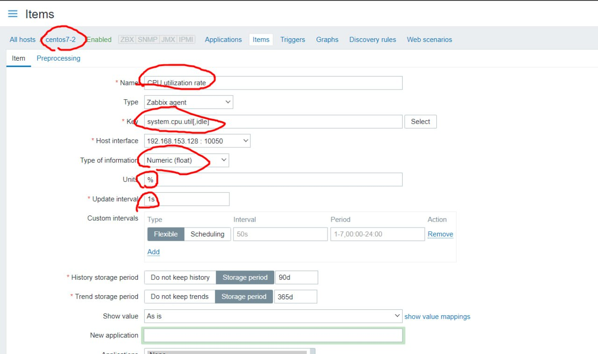
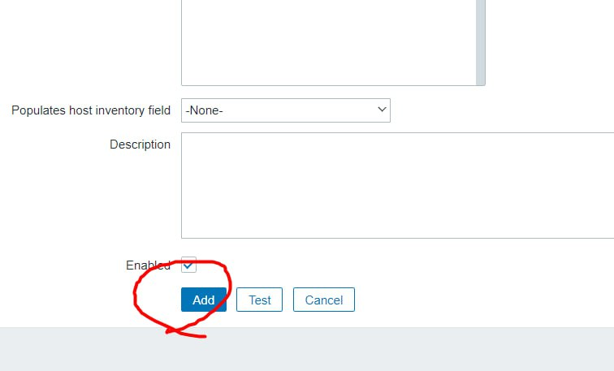
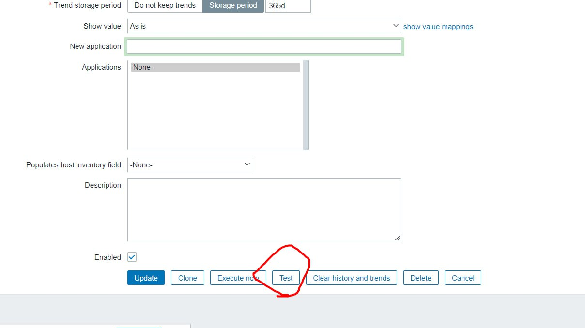
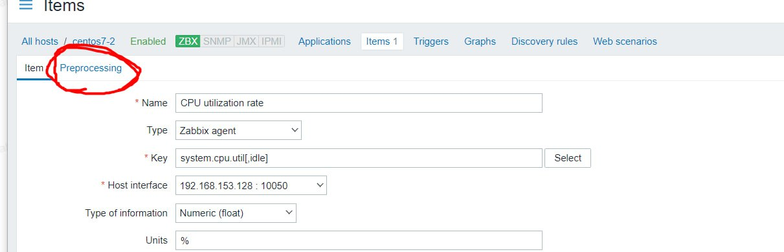
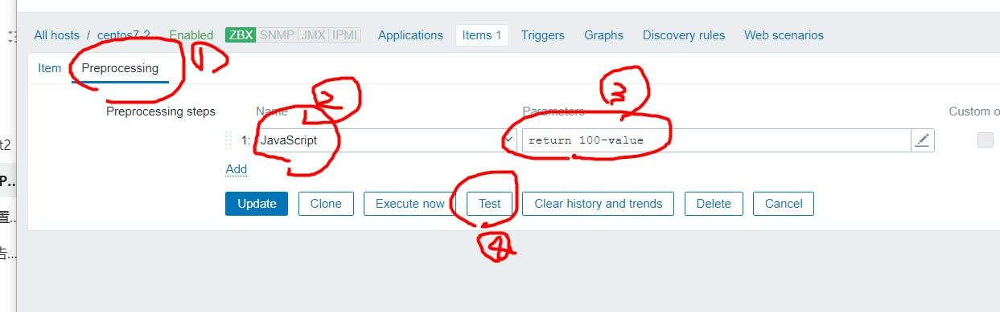
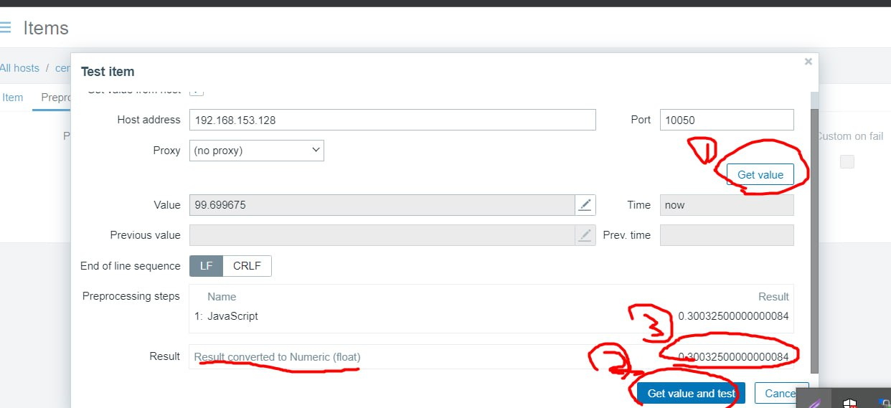
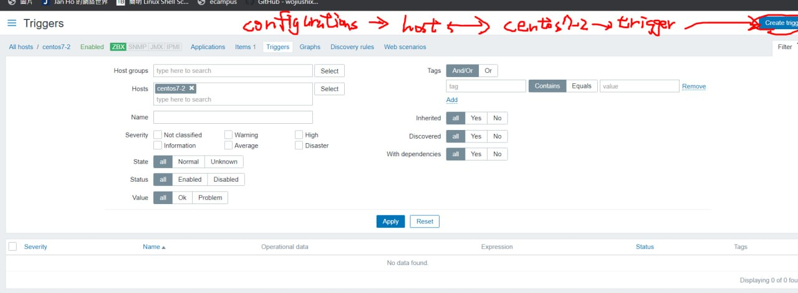
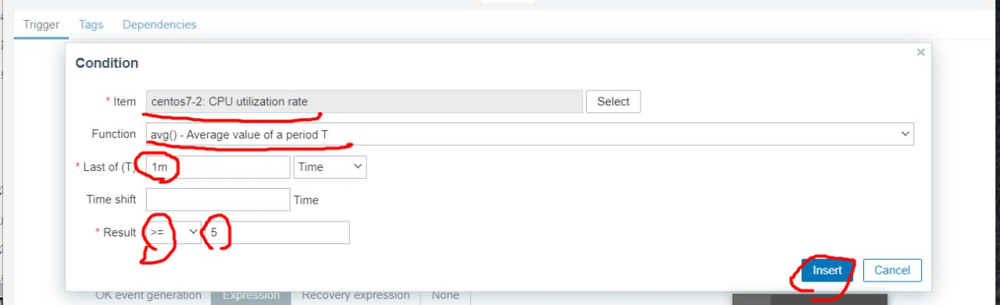
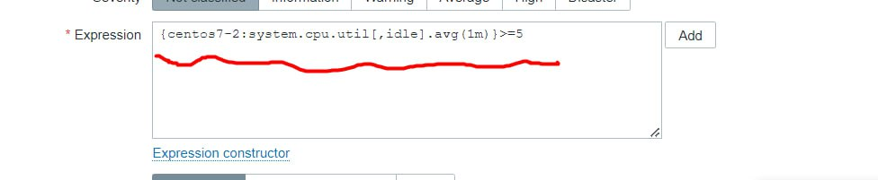
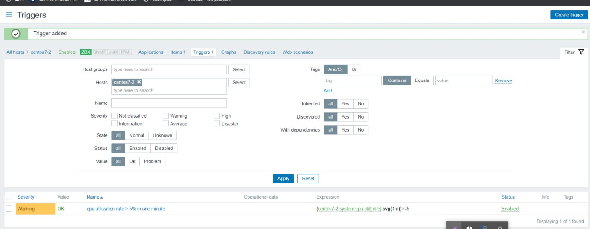<br>
***Test***
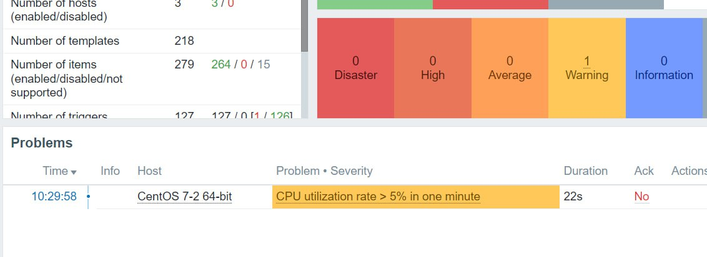
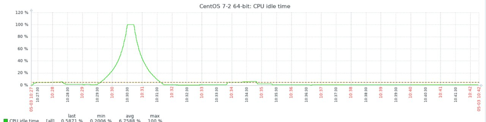
***
# send email
從2.4開始做: https://www.yuque.com/fenghuo-tbnd9/ffmkvs/mempmphi0ozeckdf#JqvfB<br>
`vim /usr/lib/zabbix/alertscripts/mailx.sh`<br>
* `$1`寄給誰`$2`標題`$3`寄給誰
```
#!/usr/bin/bash
#send mail
messages=`echo $3 | tr '\r\n' '\n'`
subject=`echo $2  | tr '\r\n' '\n'`
echo "${messages}"| mail -s "${subject}" $1 2>&1
```
* 跟改權限
<br>`chmod +x /usr/lib/zabbix/alertscripts/mailx.sh`<br>
* 測試
<br>`./mailx.sh s110910519@student.nqu.edu.tw Test "Hello World"`<br>
* change owner
<br>`$ chown -R zabbix.zabbix /usr/lib/zabbix/`<br>
## zabbix網頁
> Administration -> Media types -> Create media type
```
Name : Gmail
Type : Script
Script name : mailx.sh
Script parameters : {ALERT.SENDTO}
	                {ALERT.SUBJECT}
	                {ALERT.MESSAGE}
```
> Administration -> Media types -> Gmail 的 test
```
Send to : s110910519@student.nqu.edu.tw
```
> Administration -> Media types -> Gmail -> Message templates -> Add(Problem 、 Problem recovery) -> Update<br>
> Administration -> Users -> Admin -> Media -> Add
```
Type : Gmail
Send to : s110910514@student.nqu.edu.tw
When active : 1-7,00:00-24:00
```
> Configuration -> Actions -> Create action
```
Name : Gmail Notify action
Conditions : A	Trigger severity is greater than or equals Warning
```
 * Conditions
      ```
      Type : Trigger severity
      Operator : is greater than or equals
      Severity : Warning
      ```
 * Operations
    ```
    Operation details : 
    	Send to users : Admin (Zabbix Administrator)
    	Send only to : Gmail
    Recovery operations : 
    	Send to users : Admin (Zabbix Administrator)
    	Send only to : Gmail
    ```
### test
centos7-2<br>
  `cat /dev/urandom | md5sum`
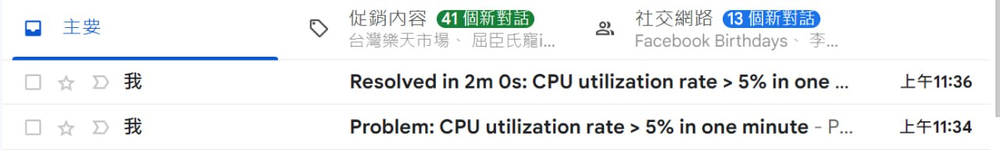
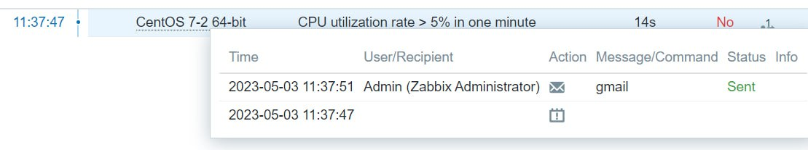
