# Zabbix Line Notify
[參考](https://dotblogs.com.tw/xerion30476/2019/08/28/153643)
> 取得line token

登入line:https://notify-bot.line.me/zh_TW/<br>
登入帳號後，下拉選項，選取「個人頁面」→「發行權杖」→「透過1對1聊天接收LINE Notify的通知」<br>
> zabbix server

`vim /usr/lib/zabbix/alertscripts/line_notify.sh`
```
#!/bin/bash
# LINE Notify Token - Media > "Send to".
TOKEN="從發行權杖取得"

# {ALERT.SUBJECT}
# subject="$1"

# {ALERT.MESSAGE}
message="$1"

curl https://notify-api.line.me/api/notify -H "Authorization: Bearer ${TOKEN}" -F "message=${message}"
```
權限
```
chmod 755 /usr/lib/zabbix/alertscripts/line_notify.sh
chown zabbix:zabbix /usr/lib/zabbix/alertscripts/line_notify.sh
```
test
```
./line_notify.sh test "Sent f from my centos7"
```
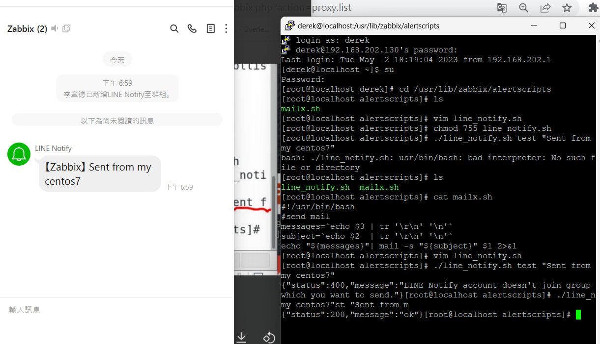
> zabbix 網頁
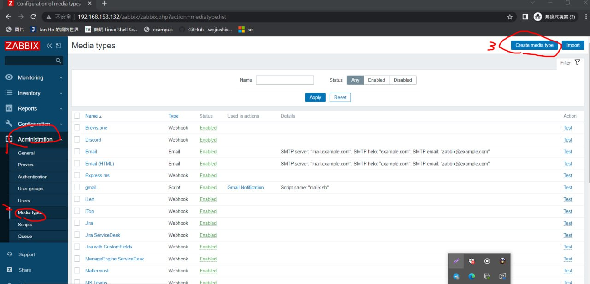
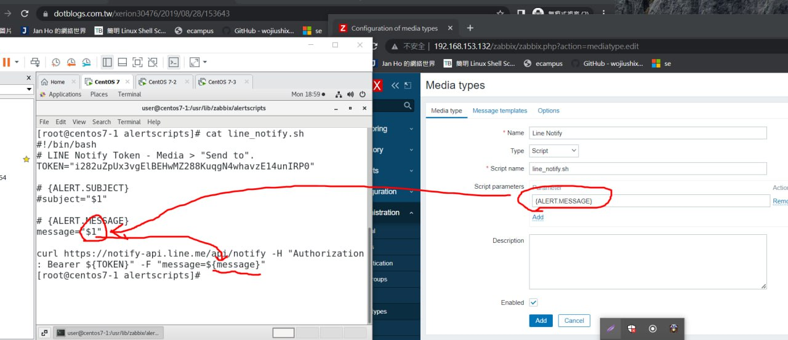
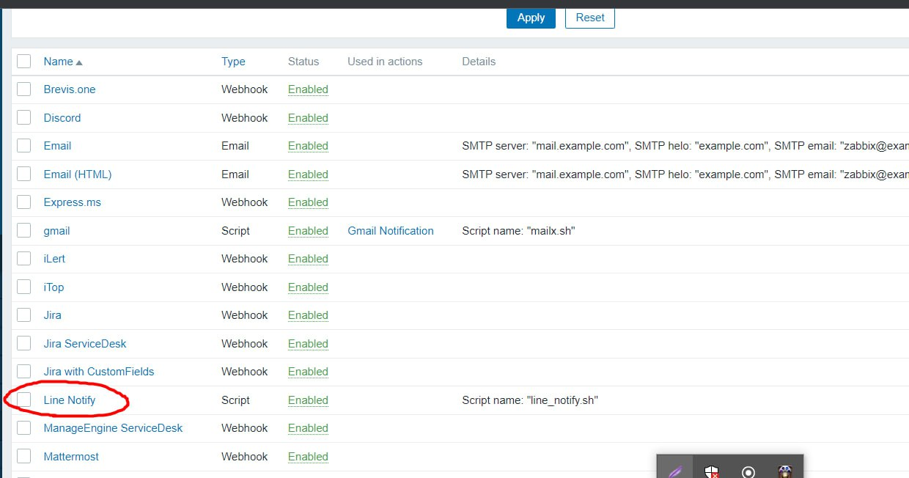
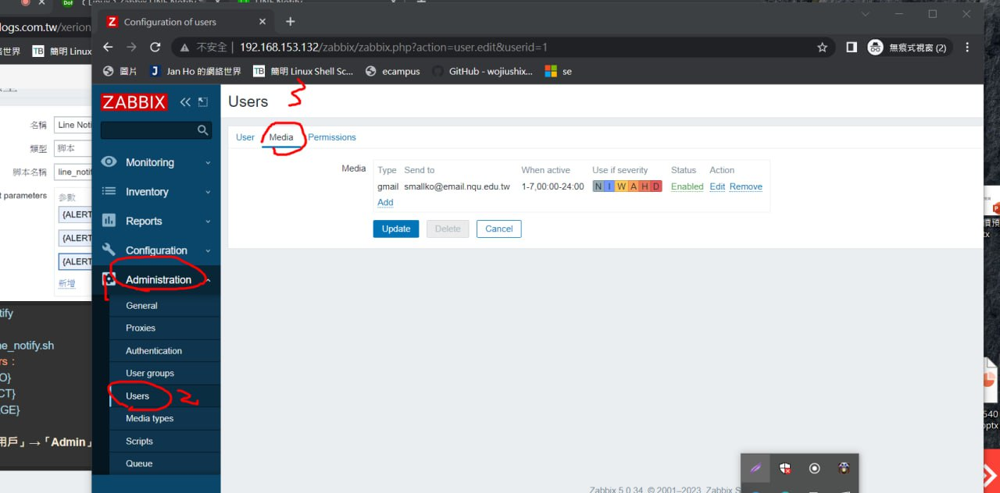
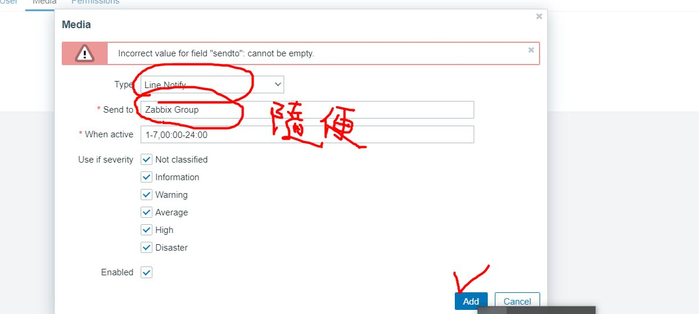
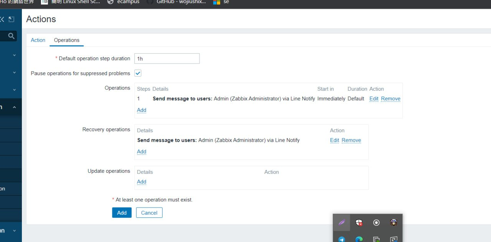

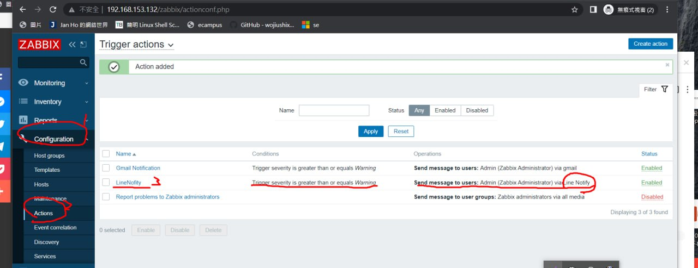
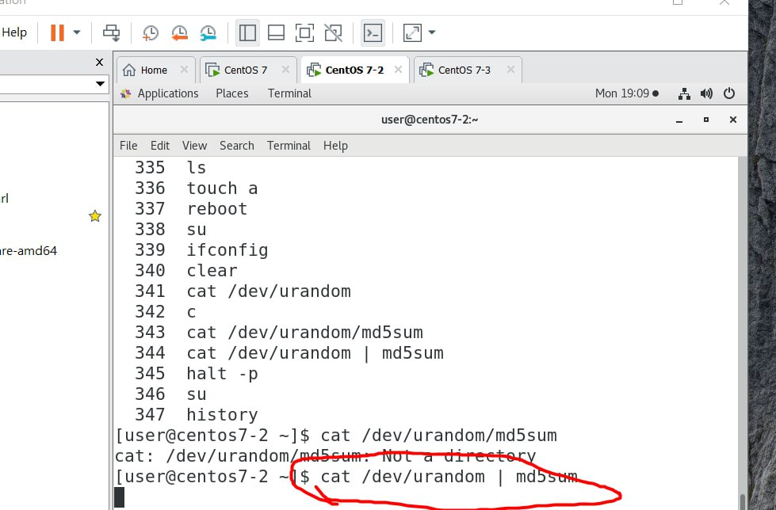
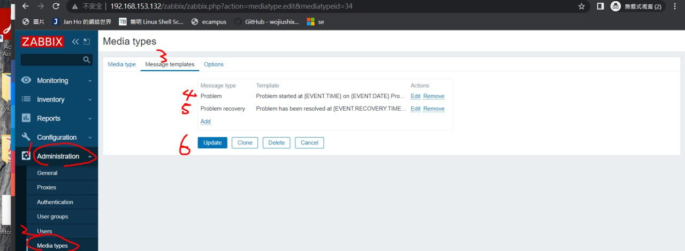
## Successfully
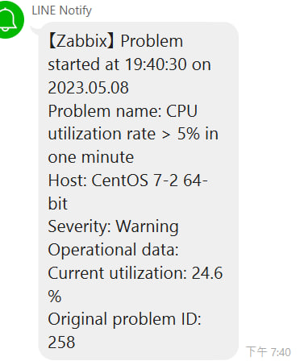
***
# custom_parameter
`vim /etc/zabbix/zabbix_agentd.conf`<br>
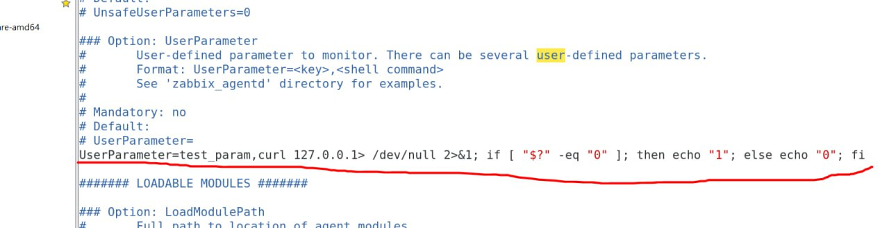
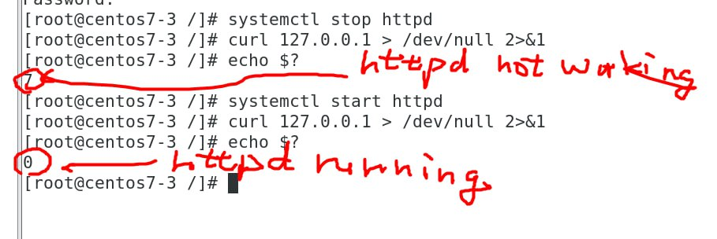

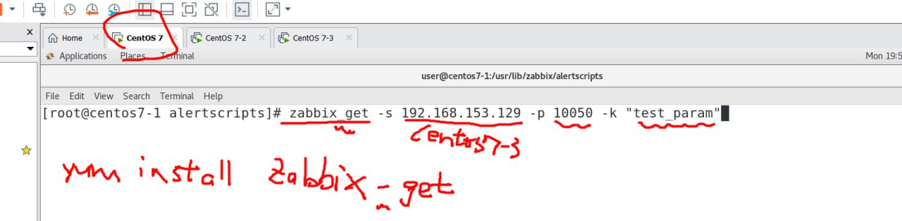
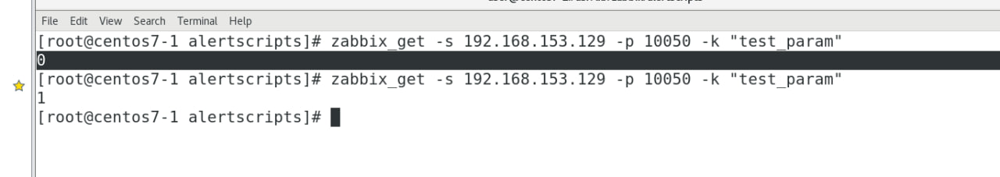
* custom item<br>
###　successfully
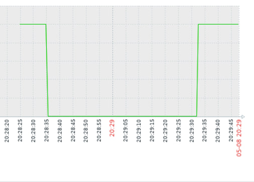
