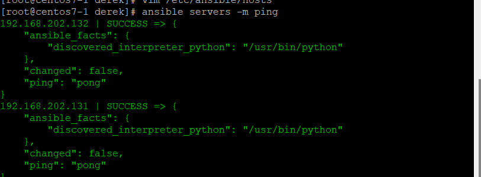

# Chatter
[使用 chattr 指令設定檔案屬性，在 Linux 中預防檔案被更改或刪除](https://blog.gtwang.org/linux/how-to-make-file-immutable-on-linux-chattr-command/)
```
chattr +i a #新增i lock
lsattr a #查看a有哪些高級屬性
chattr -i a #取消i lock
chattr +i -R #目錄底下所有檔案一起加i lock
```

* `a`：只能以附加的方式寫入（append only）。

- `c`：自動壓縮（compressed），Linux 核心會自動把檔案的內容先壓縮後，再寫入硬碟，而在讀取但內容時，Linux 核心也會自動進行解壓縮。

- `d`：在使用 `dump` 時，這種檔案會被排除（no dump）。

- `i`：檔案不可以被更動（immutable），不可以寫入、刪除、建立連結檔等。

- `s`：安全刪除檔案（secure deletion），當檔案被刪除時，系統會將所有硬碟上的檔案內容用 `0` 取代，確保檔案資料確實刪除。

- `A`：不要更新檔案存取時間（no atime updates）。

- `C`：關閉 copy-on-write（no copy on write）。

- `S`：當檔案內容更動時，馬上同步寫入硬碟（synchronous updates）。

  ***

  ## [Linux 細部權限 ACL](https://ithelp.ithome.com.tw/articles/10221185)

  ```
  id mary
  id mary > /dev/null 2>&1
  useradd mary
  useradd tom
  getfacl a    #取得檔案 a 的存取控制清單
  setfacl -m u:mary:rw a   #讓 mary 對 a 有可讀可寫的權限
  ```

  ***

  hostname set

  ```
  hostnamectl set-hostname centos7-1
  ```
   bash

  ***
## SSH無密碼登入
 


### Successfully
)
# ansible
* `vim /etc/hosts`
```
192.168.198.137 centos7-1
192.168.198.135 centos7-2
192.168.198.136 centos7-3
```
* ansible install
```
yum install ansible -y
```
* `vim /etc/ansible/hosts`

```
[server1]
192.168.202.131

[server2]
192.168.202.132

[servers]
192.168.202.131
192.168.202.132
```
`ansible servers -m ping`<br>


