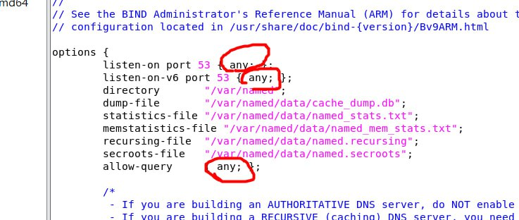

# DNS server
要連線到***www.a.come***<br>
  * `step1`: 會先在/etc/hosts查詢有沒有ww.a.com的IP位置
  * `step2`:/etc/hosts沒有找到用DNA cache search
  * `step3`:以上都沒有再用DNS server
 ### FQTN
 `Fully Qualified Domain Name`:domain name + dot<br>
### DNS Server 儲存方式

| 紀錄類型 | 意義                      | 值                             |
| -------- | ------------------------- | ------------------------------ |
| SQA      | 權限開始(權限有效期間)    | 網域的參數                     |
| NS       | DNS 伺服器                | 此網域的DNS伺服器名稱          |
| MX       | 郵件交換器                | 此網域的郵件伺服器名稱和優先度 |
| A        | 位置                      | 電腦的IP位置                   |
| PTR      | 指標(查詢給你domain name) | 電腦的名稱                     |
| CNAME    | 標準名稱(取別名)          | 電腦的別名                     |
***
## DNS server on Windows
* `nslookup`

# Bind
`yum install bind bind-chroot bind-utils`<br>
<br>
`vim /etc/named.conf`<br>
<br>
***圈起來的部分改成any***<br>
<br>
`systemctl restart named`<br>
### CMD in windows
```
nslookup www.nqu.edu.tw 192.168.202.130
# 前為想查詢的網站 、 後為虛擬機的IP位址
```
***
# Manage DNSserver
[學姊筆記](https://github.com/FUYUHSUAN/note/blob/master/110-%E4%BC%BA%E6%9C%8D%E5%99%A8%E6%9E%B6%E8%A8%AD/W12/note.md)
### 正向解析
1. 在named下新增一個網域
```
vim /var/named/a.com.zone
```
* IN SOA 後面是自己的信箱
* dns.com.&dns1 後面是虛擬機的IP address
* 之後的IP只要前面三組一樣
```
$TTL 600 ;10 minutes

@ IN SOA	@ s110910514@student.nqu.edu.tw (
		2021031803 ;serial
		10800      ;refresh
		900        ;retry
		604800     ;expire
		86400      ;minimum
		)
@		NS    dns1.a.com.
dns.com.	A     192.168.202.130
dns1		A     192.168.202.130
www		A     192.168.202.150
eshop		CNAME www
ftp		A     192.168.202.150
abc		A     192.168.202.120
```
`$TTL 600`: cache的存活時間

`@`: 代表管理的這個zone，這代表a.com

`serial`: 給定序號，通常使用日期表示，後面加上版本(01、02、03....)

2. `vim /etc/named.rfc1912.zones`
在最後面加上
```
zone "a.com" IN {
	type master;
	file "a.com.zone";
	allow-update { none; };
};
```
3. 檢查參數
```
named-checkconf
```
4. 重啟
```
systemctl restart named
```
### Successfully

### 反向解析
IP 查詢 domain name<br>
