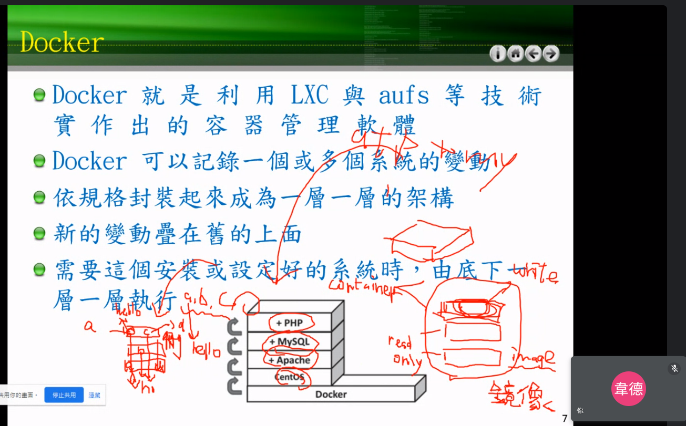
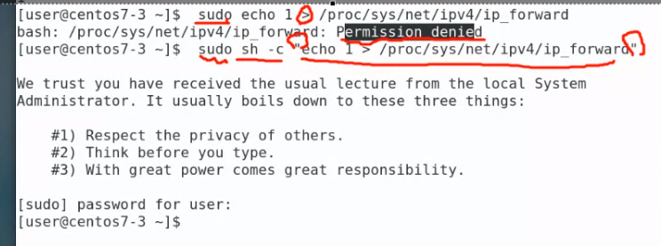
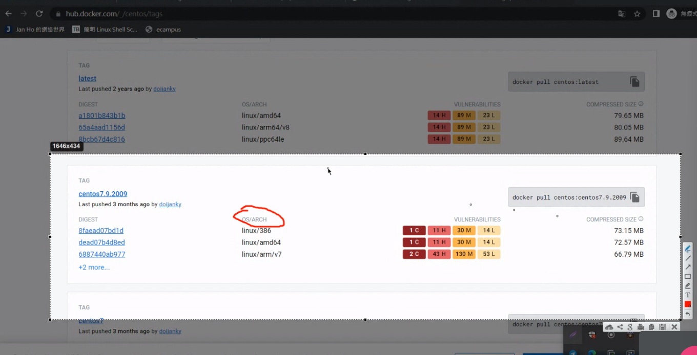
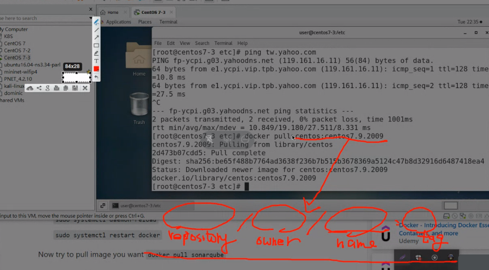
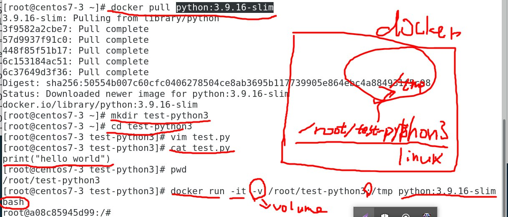
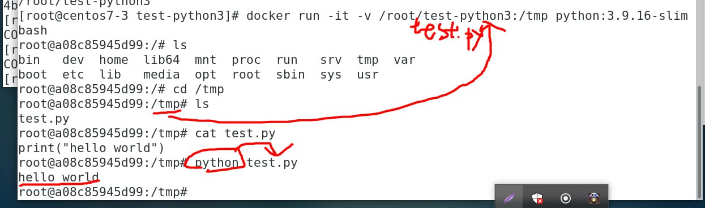

```
docker --version #檢查有沒有docker
```



```
echo 1 > /proc/sys/net/ipv4/ip_forward #可以把路由器打開 0關起來
sudo echo 1 > /proc/sys/net/ipv4/ip_forward #有大小於容易出現permission denied 要改成底下
sudo sh -c "echo 1 > /proc/sys/net/ipv4/ip_forward"
```



```
docker info #列出docker服務資訊
docker images #查看系統中有沒有任何鏡像
docker run centos:sentos7.9.2009 echo "hello"
docker run centos echo "hello" == docker run centos:latest echo "hello"
docker ps -a #可以看到死去的鏡像
docker ps #可以看到執行中的 

docker rmi (Image ID or Tag) #imageID可以打3個字
docker pull busybox #載busybo
docker run -it busybox sh #讓他一直跑sh
docker run -it --name b1 docker sh #自訂名字
docker commit b1 busybox:0.1
docker run -it --name b2 busybox:0.1 sh
docker ps -a -q #只出現contatner ID
docker rm `docker ps -a -q` #` `裡面的東西ㄗ會被替代
docker rm -f `docker ps -a -q` #-f 可以刪除還活著的檔案
```

### 去dockerhub下載鏡像



docker images 名稱格式



### docker rm (名稱or Contatner ID)  #砍容器

​	contatnerID可以只打前四個

![image-20230322104856137]images/docker05.png)

### docker rmi (Image ID or Tag) #砍映像檔

​	imageID可以打3個字

***

```
docker run -it -v /home/dere/test-python3:/tmp python:3.9.16-slim bash

```






***

# Week7(3/29)

```
docker run -d #-d在背景執行，-it互動
docker run -d centos:web /usr/sbin/apachect1 -D FOREGROUND #跑APACHE 無法連接還要host binding(把docker跟host綁定)
```

host binding

```
-p 8080:80 #8080是本機戶號 80是docker的戶號
```

### 新增網頁

1.直接進入docker(不推薦)

```
docker exec -it (Container ID) bash
```

2.docker run -d -p 8000:80 -v /home/derek/myweb:/var/www/html centos:0.2 /usr/sbin/apachectl -DFOREGROUND

```
docker rm -f (container ID) #先把容器關掉
mkdir myweb
echo "11122" > hi.htm
docker -run -d -p 8000:80 -v (本地要掛載進的資料夾路徑):(容器路徑) centos:(TAG) /usr/sbin/apachectl -DFOREGROUND
```


```
yum install haporxy
```


