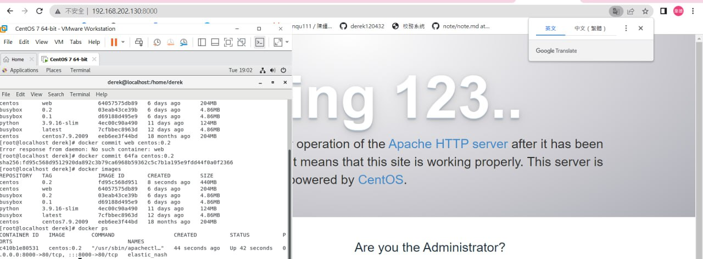
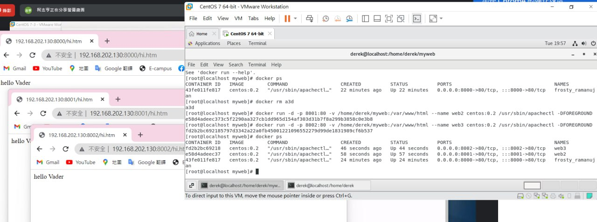

# Week7(3/29)
`-d`在背景執行，`-it`是互動<br>
`docker run -d`<br>
> 跑APACHE<br>
```
ocker run -d centos:web /usr/sbin/apachect1 -D FOREGROUND
```
無法連接還要host binding(把docker跟host綁定)
<br>
***host binding***
> test local port<br>
`netstat -tunlp | grep 8080`<br>
`$ docker run -d -p 8080:80 centos:0.01 /usr/sbin/apachectl -D FOREGROUND `<br>
```
-p 8080:80 #8080是本機戶號 80是docker的戶號
```
### Successfully

## 新增網頁

1. 直接進入docker(不推薦)

```
docker exec -it (Container ID) bash
cd /var/www/html
echo "hi 123" > hi.htm
```

2. 把資料夾連結到docker(推薦)，資料和網站是分離的
```
docker run -d -p 8000:80 -v /home/derek/myweb:/var/www/html centos:0.2 /usr/sbin/apachectl -DFOREGROUND
```

```
docker rm -f (container ID) #先把容器關掉
mkdir myweb
echo "11122" > hi.htm
docker -run -d -p 8000:80 -v (本地要掛載進的資料夾路徑):(容器路徑) centos:(TAG) /usr/sbin/apachectl -DFOREGROUND
```
## 附載均衡
* Step1:
<br>create_docker_httpd.sh
```
#!/usr/bin/bash

for i in {1..5}
do 
    portno=`expr 8000 + $i`
    docker run -d -p $portno:80 -v /home/user/class/webs/web2:/var/www/html centos:0.01 /usr/sbin/apachectl -DFOREGROUND
done
```
* step2:
<br>`chmod +x create_docker_httpd.sh`<br>
* step3:
```
yum install haproxy openssl-devel
```
`vim /etc/haproxy/haproxy.cfg`<br>
添加到文件最後面
```
defaults
  mode http
  timeout client 10s
  timeout connect 5s
  timeout server 10s
  timeout http-request 10s

frontend myfrontend
  bind 0.0.0.0:8080
  default_backend myservers

backend myservers
  balance roundrobin
  server server1 192.168.42.131:8001
  server server2 192.168.42.131:8002
  server server3 192.168.42.131:8003
  server server4 192.168.42.131:8004
  server server5 192.168.42.131:8005
```
啟動附載均衡器
```
systemctl start haproxy
```
查看8080port
```
netstat -tunlp | grep 8080
```
### Successfully

## docker hub
> save&load<br>
```docker save centos:0.01 > centos_web.tar```<br>
```docker load centos:0.01 < centos_web.tar```<br>
上傳鏡像到 [docker hub](https://hub.docker.com/)，完整名稱由三個部分組成 `[存儲位置IP](官方可省略)/[擁有者](官方可省略)/[docker名稱:tag]`，我們傳到官方，所以不用寫存儲位置IP

```
docker tag [ImageID] vader/centos:0.02
docker login  # 登入docker
docker push vader/centos:0.02  # 推鏡像
docker rmi centos:0.01            # 刪除本地鏡像
docker pull vader/centos:0.02  # 拉鏡像
```
